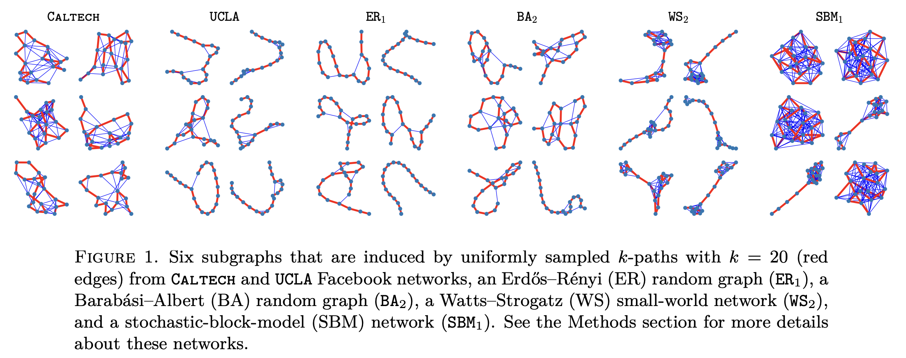

## Network Dictionary Learning (repository for paper)

  This repository contains the scripts that generate the main figures reported in the paper:  

Hanbaek Lyu, Yacoub Kureh, Joshua Vendrow, and Mason A. Porter,\
[*"Learning low-rank latent mesoscale structures in networks*"](https://arxiv.org/abs/2102.06984) (arXiv 2021)

Note (08/16/2022): There has been a major revision to the paper as well as to the algorithms. This change has not been reflected to the pypi version. 

&nbsp;

For a more user-friendly repository, please see [NDL package repository](https://github.com/jvendrow/Network-Dictionary-Learning).\
Our code is also available as the python package [**ndlearn**](https://pypi.org/project/ndlearn/) on pypi.
 

&nbsp;

&nbsp;

&nbsp;

&nbsp;

&nbsp;

&nbsp;

&nbsp;

&nbsp;

&nbsp;

&nbsp;

&nbsp;

&nbsp;

## Usage

First add network files for UCLA, Caltech, MIT, Harvard to Data/Networks_all_NDL\
Ref: Amanda L. Traud, Eric D. Kelsic, Peter J. Mucha, and Mason A. Porter,\
*Comparing community structure tocharacteristics in online collegiate social networks.* SIAM Review, 53:526–543, 2011.
&nbsp;

Then copy & paste the ipynb notebook files into the main folder. Run each Jupyter notebook and see the instructions therein. 

## File description 

  1. **utils.ndl.py** : main Network Dictionary Learning (NDL) and Network Reconstruction and Denoising (NDR) functions. 
  2. **utils.onmf.py**: Online Nonnegative Matrix Factorization algorithms (see https://github.com/HanbaekLyu/ONMF_ONTF_NDL)
  3. **helper_functions.final_plots_display.py**: helper functions for making plots 
  4. **helper_functions.helper_functions.py**: helper functions for plotting and auxiliary computation 
  5. **helper_functions.link_prediction.py: Script for network denoising benchmark experiments 
  6. **helper_functions.NDL_generate_dictionary.py: Script for generating all network dictionaries for all networks used in the paper
  7. **helper_functions.link_prediction.py: Script for network denoising benchmark experiments 
  8. **helper_functions.node2vec_helper.py: Script for using node2vec for network denoising experiments
  9. **helper_functions.node2vec.py: original node2vec wrapper reformatted 
  
## Authors

* **Hanbaek Lyu** - *Initial work* - [Website](https://hanbaeklyu.com)
* **Yakoub Kureh** - *Initial work* - [Website](https://www.math.ucla.edu/~ykureh/)
* **Joshua Vendrow** - *Initial work* - [Website](https://www.joshvendrow.com)
* **Mason A. Porter** - *Initial work* - [Website](https://www.math.ucla.edu/~mason/)

## License

This project is licensed under the MIT License - see the [LICENSE.md](LICENSE.md) file for details

